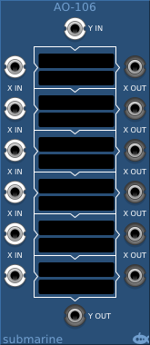
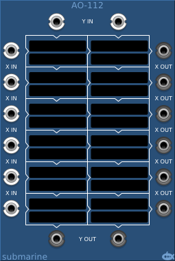
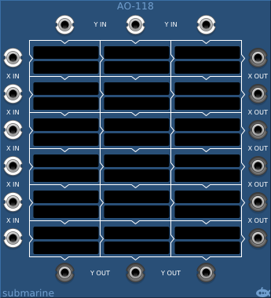
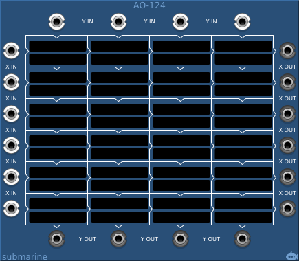
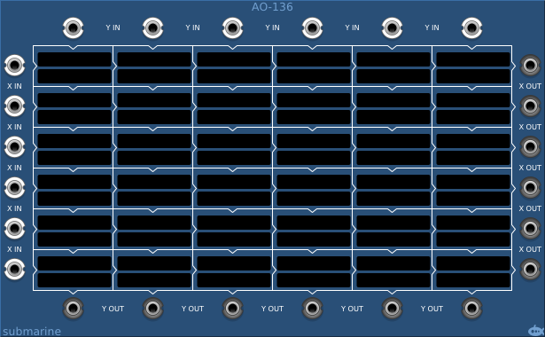

# Arithmetic Operators
#### AO-101 1 Algorithm Arithmetic Operators

#### AO-106 6 Algorithm Arithmetic Operators

#### AO-112 12 Algorithm Arithmetic Operators

#### AO-118 18 Algorithm Arithmetic Operators

#### AO-124 24 Algorithm Arithmetic Operators

#### AO-136 36 Algorithm Arithmetic Operators

## Basic Operation

The AO-1xx series of modules take a number of inputs down the left (X-inputs) and a series of inputs across the top (Y-inputs). These inputs pass through blocks which apply simple mathematical algorithms and the results of the algorithms pass out of the block down and to the right, becoming the X and Y inputs of blocks to the right and below. Each block has two touch sensitive displays; the upper display allows you to select from around 200 pre-defined algorithms; the lower display allows you to set a third value (C) on which the algorithm operates.

If no algorithm is selected, the X-input to the block passes directly through to the block (or output) on the right, and the Y-input passes directly through to the block (or output) below.

The AO-101 has just a single X and Y input, and a single output. If no algorithm is selected, the X input passes to the output.

#### [All Algorithms](AO-list.md)

#### [Oscillator Example](AO-example-osc.md)

