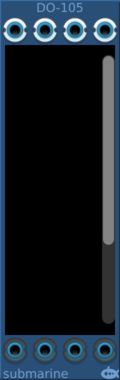
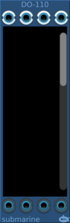
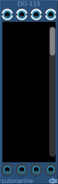

# Digital Operators
### [Part of the Digital Suite](DS.md)
#### DO-105 5 Gate Digital Operators

#### DO-110 10 Gate Digital Operators

#### DO-115 15 Gate Digital Operators

#### DO-120 20 Gate Digital Operators

## Basic Operation

The DO-1xx providers 4 polyphonic inputs and 4 polyphonic outputs. Between the two you can route through up to 20 logic gates.

## Choosing Gates

The scrollable display in the centre of the device presents between 5 and 20 selectable gates, according to the model of the device. 
Each gate can be swapped out by clicking on the gate and dragging the mouse up/down as you would a knob.

[Details of the available gates](gates/index.md)

## Routing

Gates have between 1 and 4 inputs. To the left of each gate there are 4 pads. By clicking on the pad and dragging the mouse up/down, 
you can control which pad this input is routed from. At the top of the device are 4 pads representing the device inputs, and also a black pad
which always present a logical false, and a white pad which presents a logical truth.

Below the scrolling section of the display, there are 4 further pads which connect to the device outputs. 
You can drag these in the same way to control where these outputs are routed from.

You cannot route from an output of a gate to the inputs of a gate earlier in the chain. Feedback loops are not supported directly within 
the routing of the device.  But you can connect a cable directly between the device output and the device input if you wish to incorporate feedback.

## Truth Tables

If you right click on a gate, a truth table will be displayed to help you understand the connections to and from the gate.

## Signal Range

The voltage range of the digital gates can be configured from the context menu. The device will output at the full range of the configured settings. The inputs will measure a logical high signal anywhere above the midpoint of the configured range.

## Normalling

An input not connected will generate 0V on all polyphonic channels. The meaning of 0V will depend on the digital signal range as described above.

## Polyphony

All 4 outputs will have a number of channels which is the maximum number of channels presented at the inputs. 
An input with a single channel will present that voltage across all the channels being processed. 
An input with more than one channel, but fewer than the number of channels being processed will present 0V on the excess channels.
