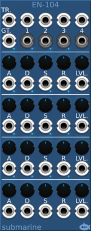

# Quad Envelope Generator and VCA
#### EN-104 Envelope Generator

## Basic Operation

The EN-104 provides 4 synchronised Envelope Generators with built in VCA. The envelope generators provide control over simple linear
ADSR shaping.
	
A single trigger input and a single gate input are provided.

Each of the 4 envelope generators has knobs and inputs to control (A)ttack rate, (D)ecay rate, (S)ustain level, (R)elease rate, and (T)otal level. Each is also associated with a numbered input and output signal. The input signal is multiplied by the envelope and sent to the output.

## Signal Range

The expected range of the numbered input and output signals is -5V to +5V. The trigger and gate will respond to a positive edge rising above 2.5V. The parameter CV inputs work to adjust the values set with the knobs. With a +10V CV input equivalent to a full range increase of the knob, and a -10V CV input equivalent to a full range decrease of the knob value.

## Normalling

If only a trigger is used, the envelope will be shaped using the attack and release phases only.

If only a gate is used, the envelope will be triggered by the gate opening, the envelope will open until the end of the attack phase, then it will decay to the sustain level for as long as the gate is open, and move to the release phase when the gate closes. If the gate is closed before the envelope reaches a peak, it will continue for the full attack phase, and then move to the release phase.

If both trigger and gate are used, the attack will start when the trigger goes high, irrespective of the state of the gate. The gate will control the sustain or release phases. If a new trigger is received the attack phase will be re-entered.

The device can be used purely as a VCA if a high voltage is applied to the gate input and a maximum sustain level is set.  The envelope will stay permanently high and the (T)otal Level parameter can be used to control the VCA.

The device can be used purely as an envelope generator if a 10V signal is applied to a numbered input. The corresponding output will present the envelope

