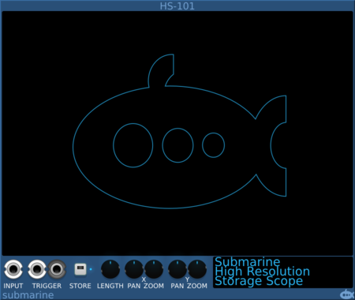

# Hi-Resolution Storage Scope
#### HS-101 Hi-Res Storage Scope

## Basic Operation

The storage scope takes a single input signal and when triggered, records that signal for a fixed period of time. Once storage is complete, the stored signal can be viewed on the display. 

The scope can store up to 64 seconds of data, even at 768KHz.

## Trigger

The scope can be triggered either by a gate or trigger pulse to the TRIGGER input, or by manually pressing the STORE button. Once triggered, a 1 ms 10V pulse is sent through the TRIGGER output, allowing multiple HS-101 devices to be synchronised, even when manually triggered.

## Length

The LENGTH knob will adjust the storage time resolution of the scope. The length of the storage buffer can be adjusted from 1 thousandth of a second up to 64 seconds.

## Viewing

The X and Y ZOOM and PAN controls allow you to choose which part of the signal you wish to view. While viewing, a tooltip on the cursor will give details of the part of the image that you are examining.

- The Voltage value at the point on the display under the cursor
- The current time since the trigger, at the point on the display under the cursor
- The current sample at the point on the display under the cursor
- The Voltage of the stored signal at the point in time under the cursor.

When zoomed out, where several samples are under the cursor, the signal voltage may be indicated by a minimum and maximum range rather than a single value.
