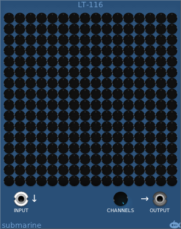

# Linear Transformations
#### LT-116 Linear Transformations

## Basic Operation

The LT-116 carries out linear transformations on the channels of a polyphonic input. There are 256 coefficient controls, allowing a variable amount of each input signal to be directed into each of the 16 output channels.

The output knob controls how many channels are present in the output.

You can use the LT-116 to blend polyphonic channels, or simply to switch channels around.

The context menu allows you to copy and paste settings, to choose some presets, or to normalise the coefficients to balance the outputs.

