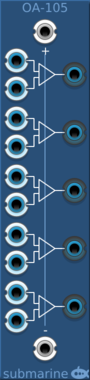

# Logical Operational Amplifiers
### [Part of the Digital Suite](DS.md)
#### OA-103 OP-Amps

#### OA-105 OP-Amps

## Basic Operation

The AG-105 provides 5 Operational Amplifiers with shared +ve and -ve rails.

Each op-amp has a pair of inputs. If the voltage of the upper input is higher than the voltage of the lower input, the output will be the +ve rail voltage. 

If the voltage of the upper input is not higher that the voltage of the lower input, the output will be the -ve rail voltage.

It can be used as a comparator.

## Signal Range

The voltage range of the digital gates can be configured from the context menu. The device will output at the full range of the configured settings. The inputs will measure a logical high signal anywhere above the midpoint of the configured range.

## Normalling

If no voltage is connected to the +ve rail input, the standard digital suite high voltage will be used. 

If no voltage is connected to the -ve rail input, the standard digital suite low voltage will be used.

The digital suite high and low voltages can be configured from the context menu.

## OA-103

The OA-103 provides three Operation Amplifiers in a small form factor. Otherwise functionality is as for the OA-105 above.
