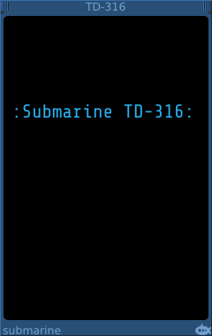
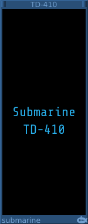

# Formattable Text Display
#### TD-116 Formattable Text Display

## Basic Operation

The TD-116 is a text display on which you can make notes or put text into the visuals of your rack. Similar to the Fundamental Notes module, the TD-116 also allows you to control the text and background colors, and also the text size. The standard text size is not easy to read in a You-Tube video, so a larger size is sometimes useful for demonstrations.

The TD-116 features [Torpedo](https://github.com/david-c14/Torpedo) input and ouput ports. Changes to the text are sent through the output port, which allows you to capture the text in any suitable Torpedo device. 

Text or formatting information can be sent into the TD-116 through the Torpedo input port, allowing you to change the text or formatting programmatically. Formatting can also be achieved through the context menu, or by using an extension device.

The TD-316 is a similar device to the TD-116 but with a 20% larger text display. Although the TD-316 does not feature Torpedo ports, it can still be formatted using the context menu or an extension device.

The [TF-101](TF.md) or [TF-102](TF.md) are suitable devices to control the formatting.

#### TD-202 Vertical Text Display

## Basic Operation

The TD-202 is a small 2-HP text display which can show a single line of text running down the rack. It is useful for labelling or separating
sections of a patch.

The colors of the TD-202 can be adjusted using the context menu. Or by using an extension device such as the [TF-101](TF.md) or [TF-102](TF.md).

#### TD-410 Multiple Label Display

## Basic Operation

The TD-410 is a 10-HP text display which can show multiple labels. It can be used next to another device to label the inputs or signal channels that you are using on that device.

Using the context menu, you can add labels to the device.

Each label has a context menu through which you can change the text, color, alignment and position of the label.

The labels can be dragged up and down the device to the position that you need.
