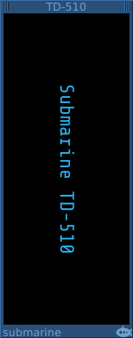

# Formattable Text Display
#### TD-316 Formattable Text Display

## Basic Operation

The TD-316 is a similar device to the now deprecated TD-116 but with a 20% larger text display. It can be formatted using the context menu or an extension device.

The TD-316 is resizable using the drag handles in the top corners of the device.

The [TF-101](TF.md) or [TF-102](TF.md) are suitable devices to control the formatting.

The TD-116 is deprecated and should not be used in new patches.

#### TD-202 Vertical Text Display

## Basic Operation

The TD-202 is a small 2-HP text display which can show a single line of text running down the rack. It is useful for labelling or separating
sections of a patch.

The colors of the TD-202 can be adjusted using the context menu. Or by using an extension device such as the [TF-101](TF.md) or [TF-102](TF.md).

#### TD-410 Multiple Label Display

## Basic Operation

The TD-410 is a 10-HP text display which can show multiple labels. It can be used next to another device to label the inputs or signal channels that you are using on that device.

Using the context menu, you can add labels to the device.

Each label has a context menu through which you can change the text, color, alignment, size and position of the label.

The labels can be dragged up and down the device to the position that you need.

The TD-410 is resizable using the drag handles in the top corners of the device.

#### TD-510 Vertical Multiple Label Display

## Basic Operation

The TD-510 is as 10-HP text display which can show multiple labels in a vertical orientation. It can be used above or below another device to lable the inputs or signal channels that you are using on that device.

Using the context menu, you can add labels to the device.

Each label has a context menu through which you can change the text, color, alignment, size, position and orientation of the label.

The labels can be dragged left and right to the position that you need.

The TD-510 is resizable using the drag handles in the top corners of the device.
