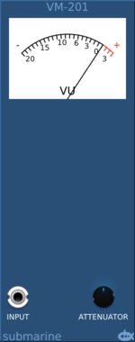
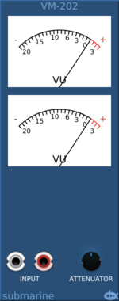

# VU Meter
#### VM-101 Compact VU Meter

#### VM-102 Compact Dual VU Meter

#### VM-201 Vintage VU Meter

#### VM-202 Dual Vintage VU Meter

## Basic Operation

The VU Meter gives a standardised view of the smoothed RMS input measured in Volume Units. The exact behaviour of a VU Meter is defined by the standard ANSI C16.5-1942.

The 0dB point is reached when the power dissipated through the load resistor is 1mW.  For the default 600Ω load resistor, this would be approximately 0.775V RMS.

The needle will take 300 milliseconds to rise from the lower rest position to within 99% of a reading of 0dB when such a voltage is applied. The needle overshoot is between 1 and 1.5 %.

## Load Resistor

The default load resistor can be swapped out for either a 150Ω or 1000Ω resistor. With a 1000Ω resistor the needle will register 0dB when a 1V RMS signal is applied.

## Attenuator

An attenuator circuit is applied to the input signal, before the meter. So that by applying an attenuation, the signal range to be metered can be adjusted. Applying a 4x attenuation to the input, will allow signals of 4 times the voltage to be measured.

For a sinusoidal bipolar wave with a peak of 5V, the RMS is approximately 3.5V.  So selecting an attenuation of 3.5 and a load of 1000Ω will measure roughly 0dbVU.  Most audio waveforms have more power than a pure sine wave.

## Inputs

The VM-102 and VM-202 meters will accept a two-channel polyphonic input. The VM-202 has two inputs, and if the second input is connected, the lower meter will display measure the second input. When only the first input is connected, the lower meter is connected to the second channel of the first (polyphonic) input.

## Compact option

The VM-101 and VM-102 are small form factor meters with OLED strip displays.
