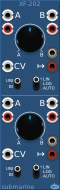
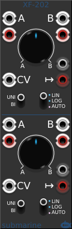
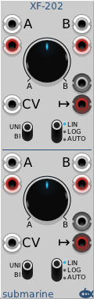
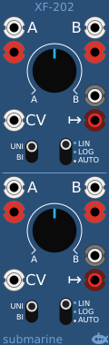
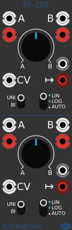
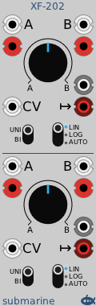

# Visual menu (skins) 

All Submarine Free modules have a Visual menu. This allows you to skin the module. 

Three colour schemes are available, default blue, dark and light.

Also you can have the default 3d look, or a flatter look if you prefer.
