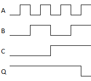

# Logic Gates
[N/C](#nc)  
[NOT gate](#not)  
[AND gate](#and)  
[3-input AND gate](#3and)  
[4-input AND gate](#4and)  
[OR gate](#or)  
[XOR gate](#xor)  
[NAND gate](#nand)  
[3-input NAND gate](#3nand)  
[4-input NAND gate](#4nand)  
[NOR gate](#nor)  
[XNOR gate](#xnor)  
[D-TYPE-FLIPFLOP](#dtypeflipflop)  
[SR-FLIPFLOP](#srflipflop)  
[D-TYPE-LATCH](#dtypelatch)  
[SR-LATCH](#srlatch)  
[LATCH](#latch)  
[DELAY](#delay)  
[CLK-DELAY](#clkdelay)  

#### Conventions used in the truth tables

Across the top, the truth table shows the inputs, internal states, and outputs of the gate in that order. 

| | |
|-|-|
| A | An input, typically for a gate where the inputs are interchangeable |
| B | An input, typically for a gate where the inputs are interchangeable |
| C | An input, typically for a gate where the inputs are interchangeable, or an input representing a clock |
| D | An input. Either the 4th input where the inputs are interchangeable, or an input carrying data |
| E | An *Enable* input. Typically if a gate has an *Enable* input, its state will not change unless *E* is high |
| R | A *Reset* input. Representing a signal to reset the output to 0 (false) |
| S | A *Set* input. Representing a signal to set the output to 1 (true) |
| Q | The output of the logic gate |
| 0 | A value of 0, logical false |
| 1 | A value of 1, logical true |
| &#x2715; | Either a 0 or a 1, false or true |
| N&#x305; | A line over a symbol indicates the logical inverse of that value |
| &#x1f809; | An upwards arrow indicates that the gate responds to a rising edge. Where the input goes from 0 to 1 |
| &#x1f80b; | A downwards arrow indicates that the gate responds to a falling edge. Where the input goes from 1 to 0 |
| N&#x2080; | A tiny 0 after a value indicates the value in the *previous* sample |
| N&#x2081; | A tiny 1 after a value indicates the value in *this* sample | 

<a name="nc" />

---

### N/C

When no gate is selected, the DO-1xx device shows N/C which is short for Not Connected. The output is always 0 (false)

<a name="not" />

---

### NOT gate

The NOT gate has a single input A. The output Q is always the logical inverse of A. So when A is 1 (true) then Q is 0 (false);
and when A is 0 (false) then Q is 1 (true)

| A | Q |
|---|---|
| 0 | 1 |
| 1 | 0 | 

<a name="and" />

---

### AND gate

The AND gate has two inputs A and B. The output Q is 1 (true) if and only if BOTH A and B are 1 (true)

| A | B | Q |
|---|---|---|
| 0 | 0 | 0 |
| 0 | 1 | 0 |
| 1 | 0 | 0 |
| 1 | 1 | 1 |

<a name="3and" />

---

### 3-input AND gate

The 3-input AND gate has three inputs A, B and C. The output Q is 1 (true) if and only if ALL OF A, B and C are 1 (true)

| A | B | C | Q |
|---|---|---|---|
| 0 | 0 | 0 | 0 |
| 0 | 0 | 1 | 0 |
| 0 | 1 | 0 | 0 |
| 0 | 1 | 1 | 0 |
| 1 | 0 | 0 | 0 |
| 1 | 0 | 1 | 0 |
| 1 | 1 | 0 | 0 |
| 1 | 1 | 1 | 1 |

<a name="4and" />

---

### 4-input AND gate

The 4-input AND gate has four inputs A, B, C and D. The output Q is 1 (true) if and only if ALL OF A, B, C and D are 1 (true)

| A | B | C | D | Q |
|---|---|---|---|---|
| 0 | 0 | 0 | 0 | 0 |
| 0 | 0 | 0 | 1 | 0 |
| 0 | 0 | 1 | 0 | 0 |
| 0 | 0 | 1 | 1 | 0 |
| 0 | 1 | 0 | 0 | 0 |
| 0 | 1 | 0 | 1 | 0 |
| 0 | 1 | 1 | 0 | 0 |
| 0 | 1 | 1 | 1 | 0 |
| 1 | 0 | 0 | 0 | 0 |
| 1 | 0 | 0 | 1 | 0 |
| 1 | 0 | 1 | 0 | 0 |
| 1 | 0 | 1 | 1 | 0 |
| 1 | 1 | 0 | 0 | 0 |
| 1 | 1 | 0 | 1 | 0 |
| 1 | 1 | 1 | 0 | 0 |
| 1 | 1 | 1 | 1 | 1 |

<a name="or" />

---

### OR gate

The OR gate has four inputs A, B, C and D. The output Q is 1 (true) if and only if ANY OF A, B, C or D are 1 (true)

| A | B | C | D | Q |
|---|---|---|---|---|
| 0 | 0 | 0 | 0 | 0 |
| 0 | 0 | 0 | 1 | 1 |
| 0 | 0 | 1 | 0 | 1 |
| 0 | 0 | 1 | 1 | 1 |
| 0 | 1 | 0 | 0 | 1 |
| 0 | 1 | 0 | 1 | 1 |
| 0 | 1 | 1 | 0 | 1 |
| 0 | 1 | 1 | 1 | 1 |
| 1 | 0 | 0 | 0 | 1 |
| 1 | 0 | 0 | 1 | 1 |
| 1 | 0 | 1 | 0 | 1 |
| 1 | 0 | 1 | 1 | 1 |
| 1 | 1 | 0 | 0 | 1 |
| 1 | 1 | 0 | 1 | 1 |
| 1 | 1 | 1 | 0 | 1 |
| 1 | 1 | 1 | 1 | 1 |

<a name="xor" />

---

### XOR gate

The XOR gate has four inputs A, B, C and D. The output Q is (true) if and only if EITHER 1 or 3 OF A, B, C or D are 1 (true).
If 0, 2 or 4 of A, B, C or D are 1 (true) then Q will be 0 (false)

| A | B | C | D | Q |
|---|---|---|---|---|
| 0 | 0 | 0 | 0 | 0 |
| 0 | 0 | 0 | 1 | 1 |
| 0 | 0 | 1 | 0 | 1 |
| 0 | 0 | 1 | 1 | 0 |
| 0 | 1 | 0 | 0 | 1 |
| 0 | 1 | 0 | 1 | 0 |
| 0 | 1 | 1 | 0 | 0 |
| 0 | 1 | 1 | 1 | 1 |
| 1 | 0 | 0 | 0 | 1 |
| 1 | 0 | 0 | 1 | 0 |
| 1 | 0 | 1 | 0 | 0 |
| 1 | 0 | 1 | 1 | 1 |
| 1 | 1 | 0 | 0 | 0 |
| 1 | 1 | 0 | 1 | 1 |
| 1 | 1 | 1 | 0 | 1 |
| 1 | 1 | 1 | 1 | 0 |

<a name="nand" />

---

### NAND gate

The NAND gate has two inputs A and B. The output Q is 1 (true) if and only if ANY OF A or B are 0 (false)

| A | B | Q |
|---|---|---|
| 0 | 0 | 1 |
| 0 | 1 | 1 |
| 1 | 0 | 1 |
| 1 | 1 | 0 |

<a name="3nand" />

---

### 3-input NAND gate

The 3-input NAND gate has three inputs A, B and C. The output Q is 1 (true) if and only if ANY OF A, B or C are 0 (false)

| A | B | C | Q |
|---|---|---|---|
| 0 | 0 | 0 | 1 |
| 0 | 0 | 1 | 1 |
| 0 | 1 | 0 | 1 |
| 0 | 1 | 1 | 1 |
| 1 | 0 | 0 | 1 |
| 1 | 0 | 1 | 1 |
| 1 | 1 | 0 | 1 |
| 1 | 1 | 1 | 0 |

<a name="4nand" />

---

### 4-input NAND gate

The 4-input NAND gate has four inputs A, B, C and D. The output Q is 1 (true) if and only if ANY OF A, B, C or D are 0 (false)

| A | B | C | D | Q |
|---|---|---|---|---|
| 0 | 0 | 0 | 0 | 1 |
| 0 | 0 | 0 | 1 | 1 |
| 0 | 0 | 1 | 0 | 1 |
| 0 | 0 | 1 | 1 | 1 |
| 0 | 1 | 0 | 0 | 1 |
| 0 | 1 | 0 | 1 | 1 |
| 0 | 1 | 1 | 0 | 1 |
| 0 | 1 | 1 | 1 | 1 |
| 1 | 0 | 0 | 0 | 1 |
| 1 | 0 | 0 | 1 | 1 |
| 1 | 0 | 1 | 0 | 1 |
| 1 | 0 | 1 | 1 | 1 |
| 1 | 1 | 0 | 0 | 1 |
| 1 | 1 | 0 | 1 | 1 |
| 1 | 1 | 1 | 0 | 1 |
| 1 | 1 | 1 | 1 | 0 |

<a name="nor" />

---

### NOR gate

The NOR gate has four inputs A, B, C and D. The output Q is 1 (true) if and only if ALL OF A, B, C and D are 0 (false)

| A | B | C | D | Q |
|---|---|---|---|---|
| 0 | 0 | 0 | 0 | 1 |
| 0 | 0 | 0 | 1 | 0 |
| 0 | 0 | 1 | 0 | 0 |
| 0 | 0 | 1 | 1 | 0 |
| 0 | 1 | 0 | 0 | 0 |
| 0 | 1 | 0 | 1 | 0 |
| 0 | 1 | 1 | 0 | 0 |
| 0 | 1 | 1 | 1 | 0 |
| 1 | 0 | 0 | 0 | 0 |
| 1 | 0 | 0 | 1 | 0 |
| 1 | 0 | 1 | 0 | 0 |
| 1 | 0 | 1 | 1 | 0 |
| 1 | 1 | 0 | 0 | 0 |
| 1 | 1 | 0 | 1 | 0 |
| 1 | 1 | 1 | 0 | 0 |
| 1 | 1 | 1 | 1 | 0 |

<a name="xnor" />

---

### XNOR gate

The XOR gate has four inputs A, B, C and D. The output Q is (true) if and only if EITHER 0, 2 or 4 OF A, B, C or D are 1 (true).
If 1 or 3 of A, B, C or D are 1 (true) then Q will be 0 (false)

| A | B | C | D | Q |
|---|---|---|---|---|
| 0 | 0 | 0 | 0 | 1 |
| 0 | 0 | 0 | 1 | 0 |
| 0 | 0 | 1 | 0 | 0 |
| 0 | 0 | 1 | 1 | 1 |
| 0 | 1 | 0 | 0 | 0 |
| 0 | 1 | 0 | 1 | 1 |
| 0 | 1 | 1 | 0 | 1 |
| 0 | 1 | 1 | 1 | 0 |
| 1 | 0 | 0 | 0 | 0 |
| 1 | 0 | 0 | 1 | 1 |
| 1 | 0 | 1 | 0 | 1 |
| 1 | 0 | 1 | 1 | 0 |
| 1 | 1 | 0 | 0 | 1 |
| 1 | 1 | 0 | 1 | 0 |
| 1 | 1 | 1 | 0 | 0 |
| 1 | 1 | 1 | 1 | 1 |

<a name="dtypeflipflop" />

---

### D-TYPE-FLIPFLOP

The D-TYPE flipflop has a single edge-triggered input C (clock). The output Q changes whenever the input C rises. i.e. when input C changes from 0 (false) to 1 (true); at that point if Q is 0 (false) it will change to 1 (true), if Q is 1 (true) it will change to 0 (false) 

| C&#x2081; | Q&#x2081; |
|---|---|
| C&#x2080; | Q&#x2080; |
| &#x1f80b; | Q&#x2080; |
| &#x1f809; | Q&#x305;&#x2080; |

<a name="srflipflop" />

---

### SR-FLIPFLOP

The SR flipflop has two inputs S (set) and R (reset). The output Q is 1 (true) if S is 1 (true). The output Q is 0 (false) if S is 0 (false) AND R is 1 (true). If both S and R are 0 (false), then Q will remain unchanged.

| S | R | Q&#x2081; |
|---|---|---|
| 0 | 0 | Q&#x2080; |
| 0 | 1 | 0 |
| 1 | &#x2715; | 1 |

<a name="dtypelatch" />

---

### D-TYPE-LATCH

The D-Type Latch has two inputs D (data) and E (enable). The output Q will be equal to the input D while E is 1 (true). When E is 0 (false) Q will remain unchanged irrespective of the state of D.

| D | E | Q&#x2081; |
|---|---|---|
| &#x2715; | 0 | Q&#x2080; |
| 0 | 1 | 0 |
| 1 | 1 | 1 |

<a name="srlatch" />

---

### SR-LATCH

The SR Latch has three inputs S (set), R (reset) and an edge triggered intput E (enable). The output Q will remain unchanged while E is 0 (false). When E rises, i.e. when E changes from 0 (false) to 1 (true) the output Q may be changed. If S is 1 (true) when E rises, then Q will be 1 (true). If S is 0 (false) and R is 1 (true) when E rises, then Q will be 0 (false).

| S | R | E&#x2081; | Q&#x2081; |
|---|---|---|---|
| &#x2715; | &#x2715; | E&#x2080; | Q&#x2080; |
| &#x2715; | &#x2715; | &#x1f80b; | Q&#x2080; |
| 0 | 0 | &#x1f809; | Q&#x2080; |
| 0 | 1 | &#x1f809; | 0 |
| 1 | &#x2715; | &#x1f809; | 1 |

<a name="latch" />

---

### LATCH

The Latch has two inputs D (data) and E (enable). When E is 0 (false) the output Q will remain unchanged. When E is 1 (true) the output Q will be the same as input D.

| D | E&#x2081; | Q&#x2081; |
|---|---|---|
| &#x2715; | E&#x2080; | Q&#x2080; |
| &#x2715; | &#x1f80b; | Q&#x2080; |
| 0 | &#x1f809; | 0 |
| 1 | &#x1f809; | 1 |

<a name="delay" />

---

### DELAY

The Delay has one input D (data). The output Q will be the same as the input D but delayed by exactly one sample.

| D&#x2081; | Q |
|---|---|
| &#x2715; | D&#x2080; |

<a name="clkdelay" />

---

### CLK-DELAY

The Clocked-Delay has two inputs C (clock) and D (data). It also has an internal register A. When the input C rises from 0 (false) to 1 (true) the output Q takes on the value of register A; AND at the same time the register A takes on the value of input D. Output Q will remain unchanged until the next time that C rises from 0 (false) to 1 (true).

| C&#x2081; | D | A&#x2081; | Q&#x2081; |
|---|---|---|---|
| C&#x2080; | &#x2715; | A&#x2080; | Q&#x2080; |
| &#x1f80b; | &#x2715; | A&#x2080; | Q&#x2080; |
| &#x1f809; | 0 | 0 | A&#x2080; |
| &#x1F809; | 1 | 1 | A&#x2080; |

